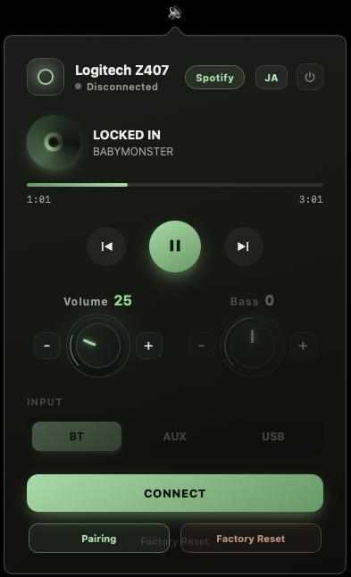
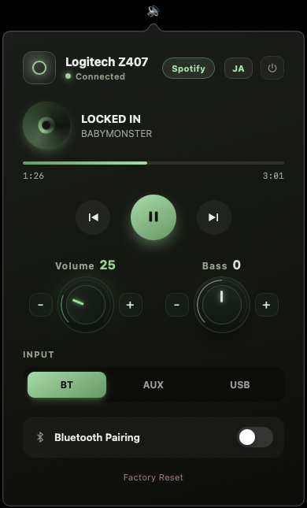

# Z407 Remote (macOS)

A menu bar app that lets you control your Logitech Z407 speakers from your Mac over BLE.

> **Target users:** for anyone who wants to control their Z407 without depending on the
> physical remote, who shares one speaker across multiple Macs, or who has lost or broken
> their physical remote and needs a replacement. 日本語: 物理リモコンに
> 依存せず Mac で操作したい方、複数の Mac でスピーカーを共用する方、物理リモコンを紛失、
> または故障してしまっていて困っている方向け。

**Official product pages:** [Japan / 日本 (ロジクール)](https://www.logicool.co.jp/ja-jp/shop/p/z407-bluetooth-computer-speakers) · [United Kingdom](https://www.logitech.com/en-gb/products/speakers/z407-bluetooth-computer-speakers.html)

A pure **macOS-native** implementation (`bleak` / CoreBluetooth + a WKWebView Aurora panel). It doesn't stay in the Dock — just one click on the 🔊 icon in the menu bar to control everything.

## Screenshots

| Before connecting | After connecting |
| --- | --- |
|  |  |

## Features

From the 🔊 menu bar icon:

- **Connect** — finds and connects to your Z407
- **Volume knob** — controls the macOS **system output** volume (0–100, in steps of 5) with a rotary knob (− / +, hold to repeat). This controls the Mac's system volume, **not the speaker's BLE volume**, and works even without a Z407 connection.
- **Bass knob** — adjusts the Z407's bass via BLE (one-way `8000`/`8001`) with a grey rotary knob. The displayed −5…+5 is a **local estimate of how many steps you've sent** — the app can't read the speaker's actual bass level. The value is **saved locally and restored on the next launch**, but **if you control the same speaker from multiple Macs (or with the physical dial), each device tracks its own estimate, so the on-screen value can drift from the speaker's actual bass**. Requires an active Z407 connection.
- **Spotify integration** — Play / Pause, Previous / Next, and now-playing info via the Spotify app
- **Z407 controls over BLE** — Input switching (Bluetooth / Aux / USB), Bluetooth Pairing, Factory Reset (with 2-tap confirmation)

> Even when not connected, you can use the "Connect & Pair" and "Connect & Reset" buttons, so you're never stuck when you hit connection trouble.

## Requirements

- Apple Silicon (M1 or later) Mac
- macOS 12 or later
- Logitech Z407 speaker (powered on, with Bluetooth)
- Homebrew (if missing, `install.sh` walks you through installing it)

## Installation (one command)

```bash
bash install.sh
```

`install.sh` does everything for you (idempotent). No sudo is required for normal use. On
first run, if Homebrew is not installed, you will be asked for your administrator password
during its installation:

1. **Sets up Python 3.12**(auto-installs `python@3.12` via Homebrew if missing)
2. Creates the runtime at `~/Library/Application Support/Z407 Remote/`(`.venv` + scripts)
3. Builds the app at `/Applications/Z407 Remote.app`(falls back to
   `~/Applications/Z407 Remote.app` if unwritable, py2app alias mode)
4. **Launches the app**(🔊 appears in the menu bar)

### On another Mac (Apple Silicon)

Clone and go:

```bash
git clone https://github.com/xzelvox/z407-mac-remote.git
cd z407-mac-remote
bash install.sh
```

Because it builds locally, you won't hit Gatekeeper/quarantine issues (if Homebrew isn't
installed, it tells you how to add it). This repository is the **source** — building from
source is the supported way to use the app. Edit the code and re-run `bash install.sh` to
apply your changes.

### Why the runtime lives on the internal disk / why py2app

- Files on an external volume (`/Volumes/...`) can't be read by an app launched via
  LaunchServices due to TCC. That's why the actual files live on the internal disk.
- If the `.app` `exec`s an external python, the running app's identity becomes
  `org.python.python`, and the `Info.plist` (`LSUIElement` / Bluetooth usage string) is
  ignored → no menu bar icon & a crash on Bluetooth use. py2app produces a proper bundle
  whose identity is `com.local.z407remote`.

## Launch

```bash
open "/Applications/Z407 Remote.app" 2>/dev/null \
    || open "$HOME/Applications/Z407 Remote.app"
```

Or launch "Z407 Remote" from Spotlight. When it starts, a **🔊** icon appears on the right
side of the menu bar (no Dock icon).

## Bluetooth permission

On the first **Connect**, macOS asks for Bluetooth permission as "**Z407 Remote**".
Please **allow** it. If the dialog doesn't appear or you denied it, enable it under
**System Settings → Privacy & Security → Bluetooth**.

## Spotify (now-playing & prev/next)

Shows the now-playing title in the menu and lets you skip **Previous / Next**.
This controls the **Spotify app directly via AppleScript** and is separate from the
Z407 BLE connection (the Spotify app must be running).

The first time you use it, macOS shows an **Automation permission** dialog. **Allow** it.
When launched from the bundle (`/Applications/Z407 Remote.app`), it appears as
"**Z407 Remote** wants to control Spotify" (if you ran it directly during development,
the permission may be attributed to a different process name). If you denied it or it
didn't appear, check **System Settings → Privacy & Security → Automation**.

YouTube is not supported (the source of playback is unreliable to identify).

## Notes & troubleshooting

- The Z407 only supports **one Bluetooth connection at a time**. If you use the physical
  remote, **remove its batteries before** connecting with this app.
- The Z407 speaker must be powered on.
- **If you can't connect**(the app also shows a hint on screen):
  - Power-cycle the Z407
  - Put the Z407 into discoverable mode with the physical remote's Bluetooth / pairing button
  - Especially right after a **Factory Reset**, the Z407 may stop advertising over BLE,
    so a power-cycle is the most reliable fix.

## How it works (GATT)

| Item | Value |
| --- | --- |
| Service | `0000fdc2-0000-1000-8000-00805f9b34fb` |
| Command (write) | `c2e758b9-0e78-41e0-b0cb-98a593193fc5` |
| Response (notify) | `b84ac9c6-29c5-46d4-bba1-9d534784330f` |

Commands are sent via `bytes.fromhex(...)`:
`bass_up=8000`, `bass_down=8001`, `volume_up=8002`, `volume_down=8003`,
`play_pause=8004`, `input_bluetooth=8101`, `input_aux=8102`, `input_usb=8103`,
`bluetooth_pair=8200`, `factory_reset=8300`, `connect=8405`.

> Note: the current UI controls **volume via the macOS system output volume** and
> **playback via the Spotify app**, so the `volume_up`, `volume_down`, and `play_pause`
> GATT commands are present in the protocol but **not sent by the current UI**. The
> `bass_up`/`bass_down` commands **are** sent by the UI (as one-way relative steps;
> there is no read-back of the current bass level).

Connection handshake: `connect()` → `start_notify` → send `8405`
→ the device notifies `d4 05 01` → the app replies with `8400`
→ the device responds `d4 00 01`, and the connection is established.

## License

**MIT License** © 2025 xzelvox. See [LICENSE](LICENSE) for details.

## Trademarks & Disclaimer

This is an **unofficial, independent project** and is **not affiliated with, endorsed by,
or sponsored by Logitech**. "Logitech" and "Z407" are trademarks of their respective owners.
This project uses those names only to describe the compatible hardware it controls.

### No warranty / use at your own risk

This software is provided **"AS IS", WITHOUT WARRANTY OF ANY KIND**, express or implied,
including but not limited to the warranties of merchantability, fitness for a particular
purpose, and noninfringement. In no event shall the author be liable for any claim, damages,
or other liability arising from, out of, or in connection with this software or its use.

**Use at your own risk.** This app sends commands to your Z407 over Bluetooth, including
**Factory Reset** which clears all pairings on the device. Neither the author nor this project
is responsible for any damage, data loss, or malfunction that may result from using it.

本ソフトウェアは**無保証**で提供されます。Bluetooth 経由で Z407 にコマンド(ファクトリー
リセット等、ペアリング全消去を含む)を送信します。**使用はすべて自己責任**で行ってください。
本アプリの使用によって生じたいかなる損害・不具合についても、作者は責任を負いません。

---

### Inspiration & acknowledgments

I used my Z407 across multiple Macs over Bluetooth, and I wanted to **stop relying on the
physical remote and handle everything from my Mac**. If the remote ever breaks, you can no
longer switch the input between **Bluetooth / AUX / USB** on the speaker itself — so a
Mac-based control app was both convenient and a good precaution.

While working on it, I came across a project building a controller app for Windows — it
strongly inspired me. I use macOS on a daily basis, so while verifying the remote's protocol
and behavior, I built a control app for macOS.

I'm deeply grateful to Georgi724, the author of the
[Logitech-Z407-Remote-Control-App](https://github.com/Georgi724/Logitech-Z407-Remote-Control-App)
that inspired this project.

This project is an **independent implementation written from scratch** for macOS. It does not
copy the source code, UI, or assets of the referenced project. The GATT values were obtained
by observing my own device for interoperability purposes. "Spotify" is a trademark of Spotify
AB, and this project is **not affiliated with or endorsed by Spotify**.

### 日本語(経緯)

Logicool Z407 を複数の Mac から Bluetooth 接続して使っていましたが、操作を Mac 単体で
完結させたいと考え、このアプリを開発しました。

本機は付属の物理リモコンが故障すると、Bluetooth / AUX / USB の入力切り替えができなくなる
弱点があります。Mac から直接操作・切り替えができるようにすることで、リモコン故障のリスクを
解消し、複数台の Mac 間でのスピーカー切り替えもよりスムーズに行えるようにしました。

本プロジェクトは macOS 向けの**独立した独自実装**です(参照元のソース・UI・アセットをコピー
していません)。GATT の値は相互運用目的で自分の機器を観察して得たものです。「Spotify」は
Spotify AB の商標であり、本プロジェクトは Spotify とは提携・承認関係にありません。
